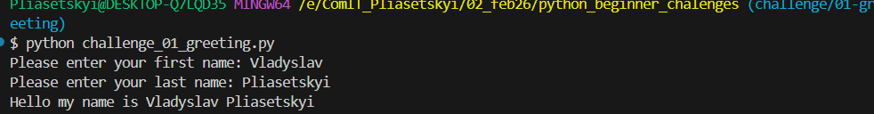
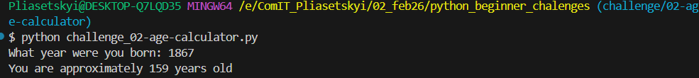
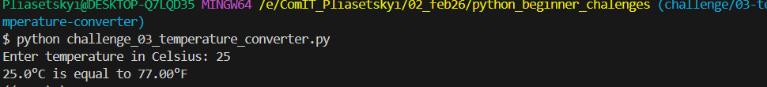

# Python Beginner Challenges

5 beginner-friendly Python challenges covering user input, string formatting, data types and data casting.

## Challenges

| # | Challenge | Branch | Status |
|---|-----------|--------|--------|
| 1 | Personalised Greeting | `challenge/01-greeting` | ✅ Done |
| 2 | Age Calculator | `challenge/02-age-calculator` | ✅ Done |
| 3 | Temperature Converter | `challenge/03-temperature-converter` | ✅ Done |
| 4 | Shopping Receipt | `challenge/04-shopping-receipt` | ⏳ Pending |
| 5 | Profile Card | `challenge/05-profile-card` | ⏳ Pending |

## Outputs

### Challenge 1 — Personalised Greeting

**Concepts:** `input()`, f-strings, string concatenation

**Solution file:** `challenge_01_greeting.py`

**Output:**

### Challenge 2 - Age Calculator

**Concepts:** `input()`,f-strings, string concatenation, adding variables, `int()`

**Solution file:** `challenge_02-age-calculator.py`

**Output:**

### Challenge 3 - Temperature Converter

**Concepts:** `input()`, casting with `float()`, arithmetic, f-strings with formatting specifiers

**Solution file:** `challenge_03_temperature_converter.py`

**Output:**

